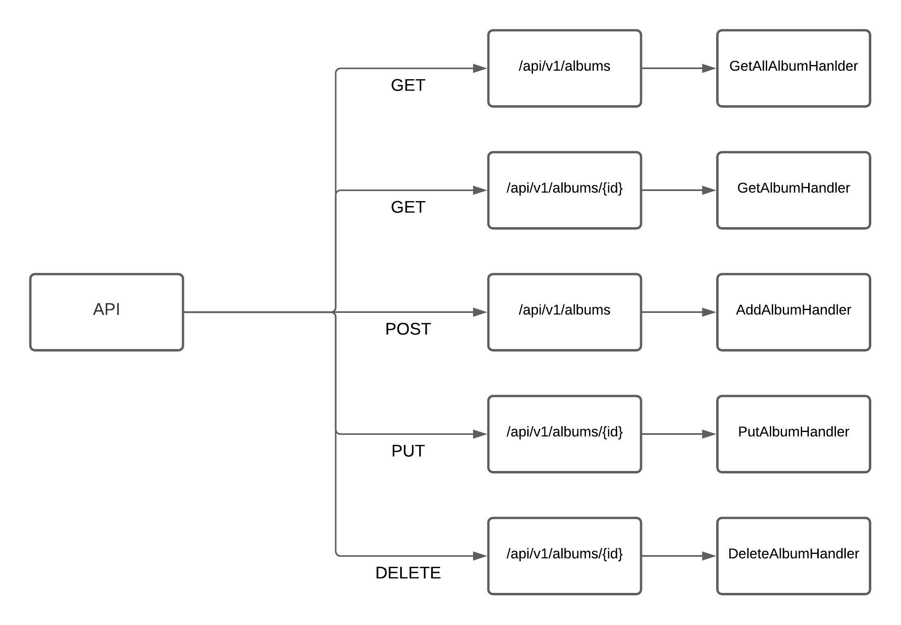

I am creating my first API with GO.

## Install 

```
go get -u github.com/Yefhem/basic-api-with-go
```

## Packages

- github.com/gorilla/mux
- gorm.io/driver/postgres
- gorm.io/gorm  

## Scheme



## Run

in project directory:

```
make run
```
or
```
go run cmd/main.go
```